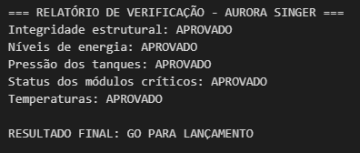
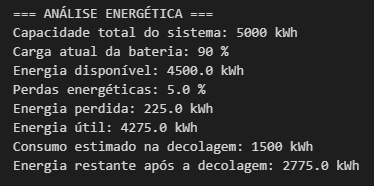

# 🚀 Missão Aurora Singer

## Relatório Operacional de Pré-Decolagem

Projeto desenvolvido para a **Fase 1 da FIAP**, com o objetivo de simular um processo de verificação operacional de pré-decolagem por meio da análise de dados de telemetria.

O projeto utiliza conceitos de lógica de programação, Python, análise energética e Inteligência Artificial para avaliar as condições simuladas da missão e determinar se o sistema está **GO PARA LANÇAMENTO** ou **NOT-GO – LANÇAMENTO ABORTADO**.

> As faixas e valores utilizados neste projeto são premissas acadêmicas definidas pelo grupo para fins de simulação.

---

## 📡 Telemetria analisada

O sistema verifica os seguintes grupos de dados:

- Integridade estrutural;
- Níveis de energia;
- Pressão dos tanques;
- Status dos módulos críticos;
- Temperaturas.

Para cada grupo foram definidos critérios de aprovação utilizados pelo algoritmo durante a simulação.

---

## 🧠 Lógica de verificação

O algoritmo verifica individualmente cada grupo da telemetria.

A missão recebe **GO PARA LANÇAMENTO** somente quando todas as condições são aprovadas.

Caso pelo menos uma condição seja reprovada, o resultado é **NOT-GO – LANÇAMENTO ABORTADO**.

---

## ⚡ Análise energética

Para a simulação foram considerados:

- Capacidade total do sistema: **5000 kWh**
- Carga da bateria: **90%**
- Consumo estimado na decolagem: **1500 kWh**
- Perdas energéticas estimadas: **5%**

### Resultado

- Energia disponível: **4500 kWh**
- Energia perdida: **225 kWh**
- Energia útil: **4275 kWh**
- Energia restante após a decolagem: **2775 kWh**

---

## 🤖 Análise assistida por Inteligência Artificial

A Inteligência Artificial foi utilizada como ferramenta de apoio à interpretação dos dados simulados.

A análise auxilia na:

- classificação dos parâmetros;
- identificação de possíveis anomalias;
- análise dos riscos associados aos critérios;
- elaboração de uma conclusão técnica.

A decisão final de lançamento permanece baseada nas regras implementadas no algoritmo desenvolvido pelo grupo.

---

## 🛠️ Tecnologias utilizadas

- Python
- Jupyter Notebook
- Visual Studio Code
- GitHub
- Inteligência Artificial (Claude)

---

## ▶️ Como executar

### Jupyter Notebook

1. Faça o download ou clone deste repositório.
2. Abra o arquivo `missao_aurora.ipynb` em um ambiente compatível com Jupyter Notebook.
3. Selecione um kernel Python.
4. Execute todas as células na ordem ou utilize **Run All**.
5. Consulte o relatório de verificação e a análise energética exibidos no próprio Notebook.

### Script Python

Também é possível executar o arquivo Python pelo terminal:

```bash
py Aurora_final_atualizado.py
```

Informe os dados solicitados pelo programa e aguarde a apresentação do relatório final.

---

## 📊 Resultado da simulação

Com os dados simulados utilizados na execução final, todos os grupos de telemetria foram aprovados.

**Resultado final: GO PARA LANÇAMENTO 🚀**

---

## 📸 Evidências de execução

### Verificação da telemetria



### Análise energética



---

## 👥 Integrantes — Grupo 37

- **Enzo Yugi Kloiwa** — RM 574398
- **Guilherme de Souza Santos** — RM a preencher
- **Luke Malaquias Lage** — RM 574356
- **Rafaela Aparecida dos Santos Atanásio** — RM 574868
- **Yasmin Sampaio Barbieri** — RM 576282

---

## 📚 Sobre o projeto

Este projeto possui finalidade exclusivamente acadêmica e foi desenvolvido como parte da Fase 1 da FIAP.
